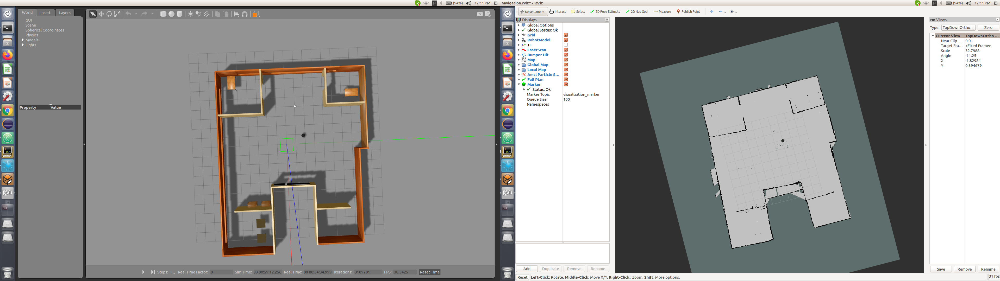
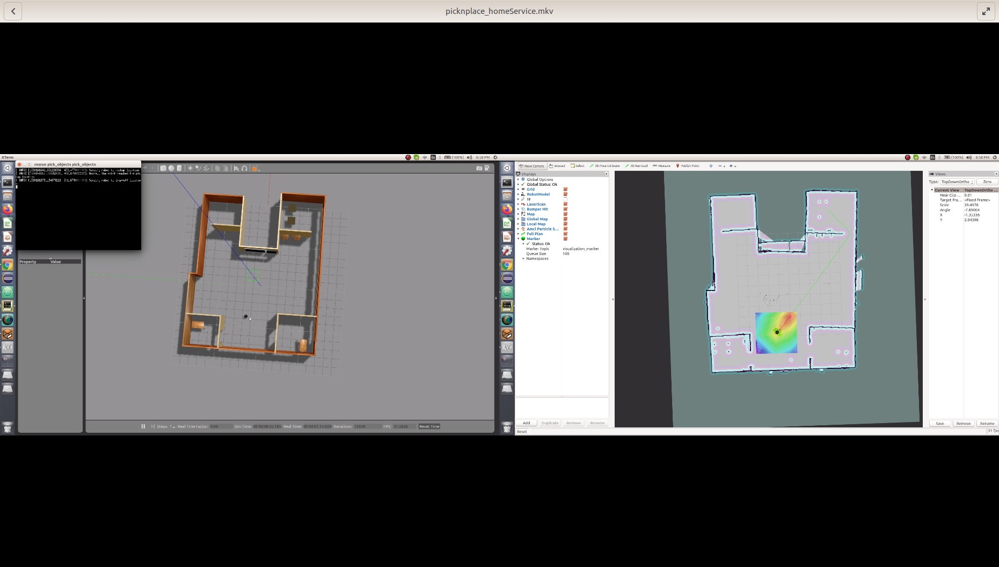

# Home Service robot

## Overview
The project uses a custom world map along with TurtleBot2 to simulate a service robot typically in a home doing pick and drop of objects. In the simulation, the objects are shown with the help of markers and can be visualized in Rviz.

## Dependencies

### ROS packages

ROS Official Packages
1. GMapping - Gmapping is used to create a map of the environment using TurtleBot2. The resulat of Gmapping can be found in the map folder.
2. AMCL - AMCL is used to localize the robot in the map created using GMapping
3. TurtleBot2 - The package contains all the required files for the robot
4. Teleop - The package was used to navigate the robot in the world map for GMapping

User created ROS Packages
1. add_markers - The package communicates with the odometry of the robot and adds, deletes the marker representing objects
2. pick_objects - The package gives TurtleBOt2 commands to move to a given goal location and is used to navigate to the pick and drop locations.
3. home_service - The package contains the world map, allowing to leverage rospack find in order to pass the world map as a parameter.

## Build and Run

Clone the repository in a catkin workspace:\
`git clone https://github.com/Ytodi31/Home_Service_Robot`

From the root of the catkin workspace, build the package by running : \
`catkin_make`

Source the package using the following from the root folder of the workspace: \
`source ./devel/setup.bash`

The project can be run using shell scripts described below.

### Scripts

Shell scripts are created to run different nodes. The shell scripts can be converted into an executable with the following command :\
`chmod +x _name_of_script.sh`

### Mapping
To create a map of the environment, run the following from the scripts folder:\
`./test_slam.sh ` \
 This will launch the TurtleBot in the world along with RVIZ, gmapping and tele-operation.

### Localization
To test localization of the robot in the given world, run the following from the scripts folder:\
`./test_navigation.sh ` \
 This will launch the TurtleBot in the world along with RVIZ & AMCL.

### Visualization of markers
To test the visualization of markers at pick and drop location, run the following from the scripts folder:\
`./add_markers.sh ` \
 This will launch the TurtleBot in the world along with RVIZ, AMCL and add_markers node.

 ### Home Service
 To run the main project code, run the following from the scripts folder:\
 `./home_service.sh` \
  This will launch the TurtleBot in the world along with RVIZ, AMCL, pick objects node and home service node.

## Results and  Output

The following map was created by using Gmapping on the robot with tele-operation :

The image below represents the working project :

The pick and place operation of the service robot can be seen in this link-(https://youtu.be/iAVt4j5E6f8).
A copy of the video can also be found in the output folder of the repository.
